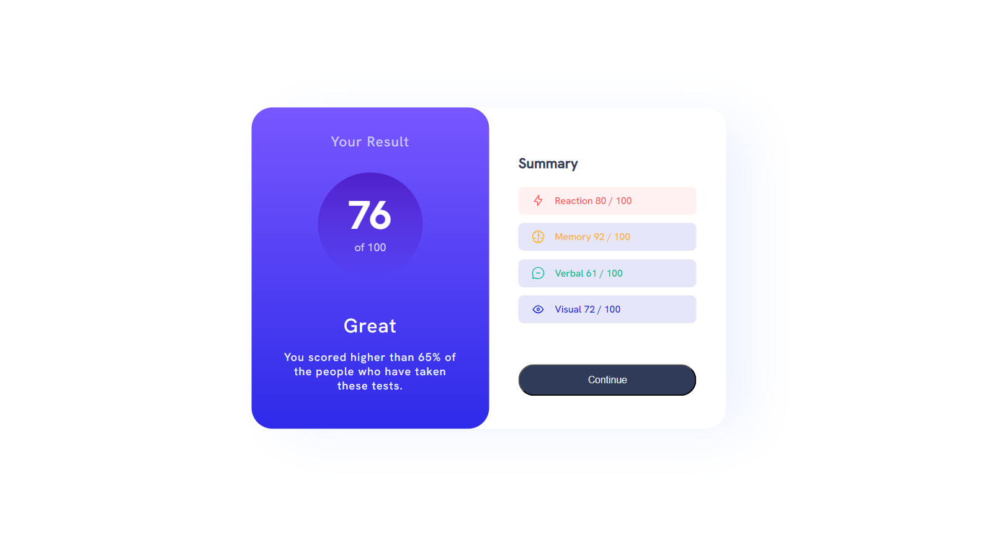
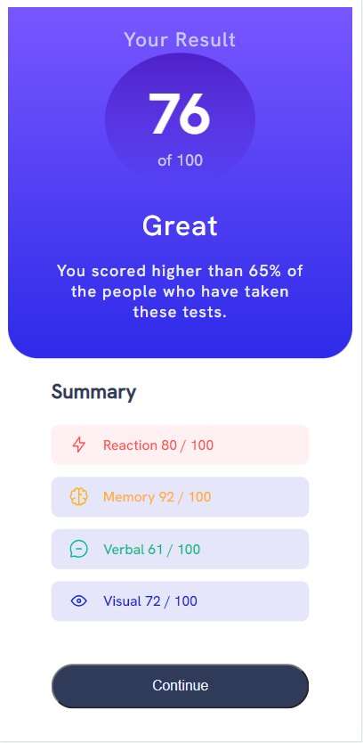

# Frontend Mentor - Results summary component solution

This is a solution to the [Results summary component challenge on Frontend Mentor](https://www.frontendmentor.io/challenges/results-summary-component-CE_K6s0maV). Frontend Mentor challenges help you improve your coding skills by building realistic projects. 

## Overview

### The challenge

Users should be able to:

- View the optimal layout for the interface depending on their device's screen size

### Screenshot

### Links

- Live Site URL: [https://results-summary-component-seven-chi.vercel.app/]
## My process

### Built with

- HTML5 & CSS

## Author

- Website - [Silvia Hernández Blázquez]
- Frontend Mentor - [@silvia-hdez](https://www.frontendmentor.io/profile/silvia-hdez)

